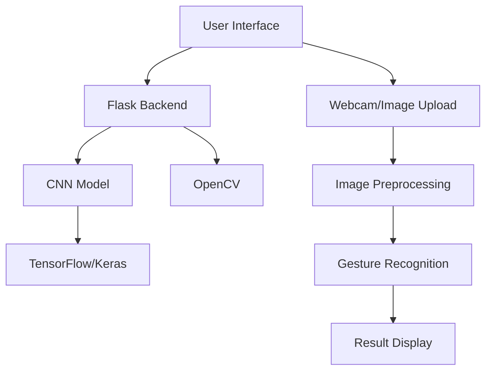

# System Architecture

## Components

1. **Frontend (User Interface)**
   - HTML/CSS/JavaScript
   - Webcam access
   - Image upload functionality
   - Real-time gesture display

2. **Backend (Flask Server)**
   - REST API endpoints
   - Image processing
   - Model inference
   - Response handling

3. **Machine Learning Model**
   - CNN architecture
   - TensorFlow/Keras implementation
   - Gesture classification
   - Confidence scoring

4. **Computer Vision**
   - OpenCV for image processing
   - Preprocessing pipeline
   - Frame capture from webcam
   - Image normalization

## Data Flow

1. User interacts with the web interface
2. Image is captured from webcam or uploaded
3. Image is sent to Flask backend
4. Backend preprocesses the image using OpenCV
5. Preprocessed image is fed to CNN model
6. Model returns gesture prediction with confidence
7. Result is sent back to frontend for display